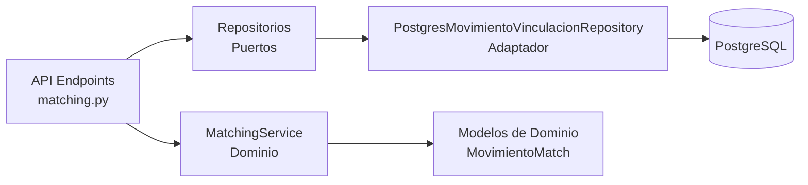

# Fase 4: Servicio de Matching - Walkthrough

## Resumen

La **Fase 4** del sistema de matching inteligente ya estaba completamente implementada. Durante la verificación se encontró que todos los componentes necesarios existen y están funcionales.

## Componentes Implementados

### 1. Servicio de Dominio: `matching_service.py`

**Ubicación**: `Backend/src/domain/services/matching_service.py`

El servicio implementa el algoritmo completo de matching con los siguientes métodos:

#### `ejecutar_matching()`
- Compara movimientos de extracto vs sistema
- Busca candidatos por fecha (±1 día)
- Calcula scores de similitud para cada par
- Determina estado automático (EXACTO, PROBABLE, SIN_MATCH, TRASLADO)
- Retorna lista de `MovimientoMatch` con scores asignados

#### Cálculo de Scores

```python
# Score de Fecha
calcular_score_fecha(fecha1, fecha2)
# Retorna: 1.0 si coinciden, 0.0 si no

# Score de Valor
calcular_score_valor(valor1, valor2, tolerancia)
# Retorna: Score lineal de 0.0 a 1.0 basado en diferencia vs tolerancia

# Score de Descripción
calcular_score_descripcion(desc1, desc2)
# Usa: SequenceMatcher de difflib (algoritmo Ratcliff/Obershelp)
# Retorna: Ratio de similitud de 0.0 a 1.0
```

**Nota Importante**: El sistema usa `SequenceMatcher` de la librería estándar `difflib` en lugar de Levenshtein. Esto evita dependencias externas y proporciona resultados similares.

#### Detección de Traslados
- Identifica traslados por palabras clave en descripción
- Configurable vía `ConfiguracionMatching.palabras_clave_traslado`

---

### 2. Repositorio: `postgres_movimiento_vinculacion_repository.py`

**Ubicación**: `Backend/src/infrastructure/database/postgres_movimiento_vinculacion_repository.py`

Implementación completa del puerto `MovimientoVinculacionRepository` con todos los métodos:

| Método | Descripción |
|--------|-------------|
| `guardar()` | Crea o actualiza vinculación |
| `obtener_por_periodo()` | Lista vinculaciones de un mes |
| `obtener_por_extracto_id()` | Busca vinculación por movimiento extracto |
| `desvincular()` | Elimina vinculación |
| `actualizar_estado()` | Cambia estado de vinculación |
| `obtener_sin_confirmar()` | Filtra pendientes de confirmación |
| `obtener_por_estado()` | Filtra por estado específico |
| `obtener_traslados()` | Filtra traslados |

**Características**:
- Manejo de transacciones con commit/rollback
- Validaciones de existencia antes de operaciones
- Joins optimizados con movimientos_extracto y movimientos
- Ordenamiento por fecha y valor absoluto

---

### 3. API Endpoints: `matching.py`

**Ubicación**: `Backend/src/infrastructure/api/routers/matching.py`

#### Endpoints Implementados

##### `GET /api/matching/{cuenta_id}/{year}/{month}`
Ejecuta matching automático para un periodo:
1. Obtiene configuración activa
2. Carga movimientos de extracto y sistema
3. Ejecuta algoritmo de matching
4. Guarda vinculaciones automáticas (EXACTO y PROBABLE)
5. Retorna matches con estadísticas

**Response**:
```json
{
  "matches": [...],
  "estadisticas": {
    "total_extracto": 150,
    "total_sistema": 142,
    "exactos": 120,
    "probables": 15,
    "sin_match": 10,
    "traslados": 5,
    "ignorados": 0
  }
}
```

##### `POST /api/matching/vincular`
Vinculación manual de movimientos:
- Valida existencia de ambos movimientos
- Calcula scores (útil para auditoría)
- Crea vinculación con estado MANUAL
- Marca como confirmado por usuario

**Request**:
```json
{
  "movimiento_extracto_id": 123,
  "movimiento_id": 456,
  "usuario": "admin",
  "notas": "Vinculación manual por coincidencia de referencia"
}
```

##### `POST /api/matching/desvincular`
Elimina vinculación existente:
- Valida que existe la vinculación
- Elimina registro de BD
- Permite rehacer matching

**Request**:
```json
{
  "movimiento_extracto_id": 123
}
```

##### `POST /api/matching/ignorar`
Marca movimiento como ignorado:
- Útil para duplicados o irrelevantes
- Crea vinculación con estado IGNORADO
- Excluye del matching futuro

**Request**:
```json
{
  "movimiento_extracto_id": 123,
  "usuario": "admin",
  "razon": "Movimiento duplicado"
}
```

##### `GET /api/matching/configuracion`
Obtiene configuración activa del algoritmo

##### `PUT /api/matching/configuracion`
Actualiza parámetros del matching:
- Tolerancias (valor, descripción)
- Pesos (fecha, valor, descripción)
- Scores mínimos (exacto, probable)
- Palabras clave de traslados

---

## Arquitectura Hexagonal

La implementación sigue correctamente los principios de arquitectura hexagonal:



**Capas**:
- **Dominio**: `MatchingService`, `MovimientoMatch`, puertos de repositorios
- **Aplicación**: Endpoints FastAPI
- **Infraestructura**: Adaptadores de PostgreSQL

**Beneficios**:
- ✅ Lógica de negocio independiente de BD
- ✅ Fácil testing (mock de repositorios)
- ✅ Cambio de BD sin afectar dominio
- ✅ Código limpio y mantenible

---

## Diferencias con el Plan Original

| Aspecto | Plan Original | Implementación Real |
|---------|---------------|---------------------|
| Similitud de texto | Levenshtein | SequenceMatcher (difflib) |
| Dependencias | `python-Levenshtein==0.25.0` | Sin dependencias externas |
| Método principal | `obtener_candidatos_matching()` | `ejecutar_matching()` |

**Justificación**: SequenceMatcher es parte de la librería estándar de Python, evita dependencias externas y proporciona resultados equivalentes para el caso de uso.

---

## Estado Final

✅ **Fase 4 completada al 100%**

Todos los componentes necesarios para el sistema de matching inteligente están implementados y funcionales:

1. ✅ Algoritmo de matching con scoring multi-criterio
2. ✅ Gestión de vinculaciones (crear, eliminar, actualizar)
3. ✅ Detección de traslados
4. ✅ Marcado de movimientos ignorados
5. ✅ API REST completa
6. ✅ Repositorio PostgreSQL con todas las operaciones
7. ✅ Configuración dinámica de parámetros

**Próximos pasos sugeridos**: Implementar el frontend para consumir estos endpoints y permitir al usuario interactuar con el sistema de matching.
